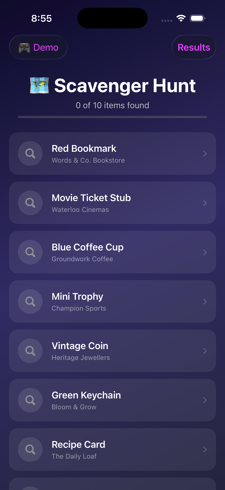
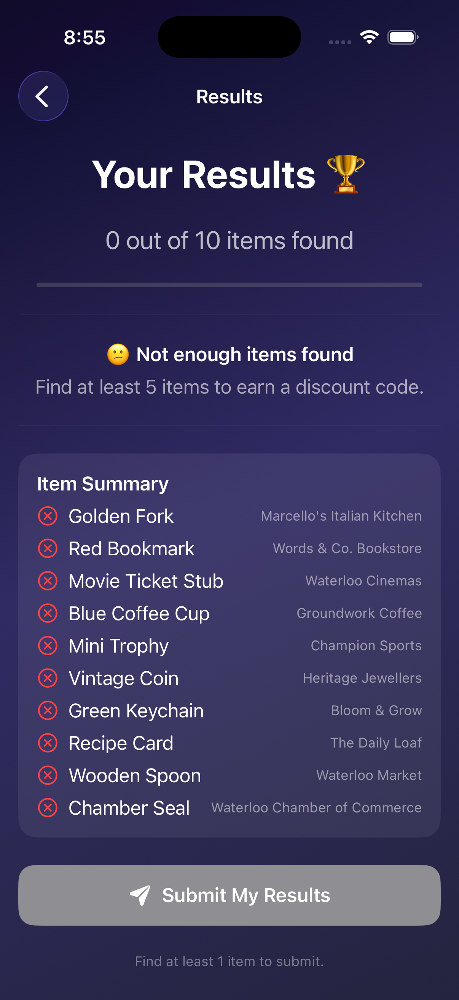
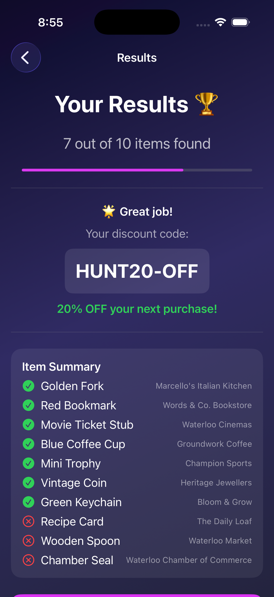
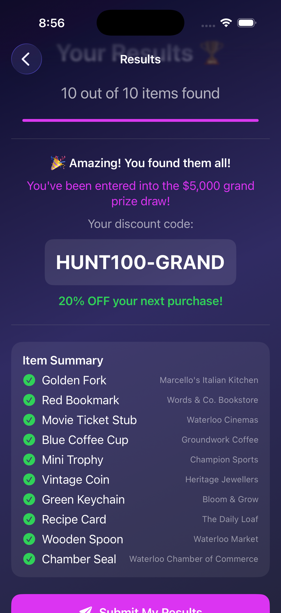
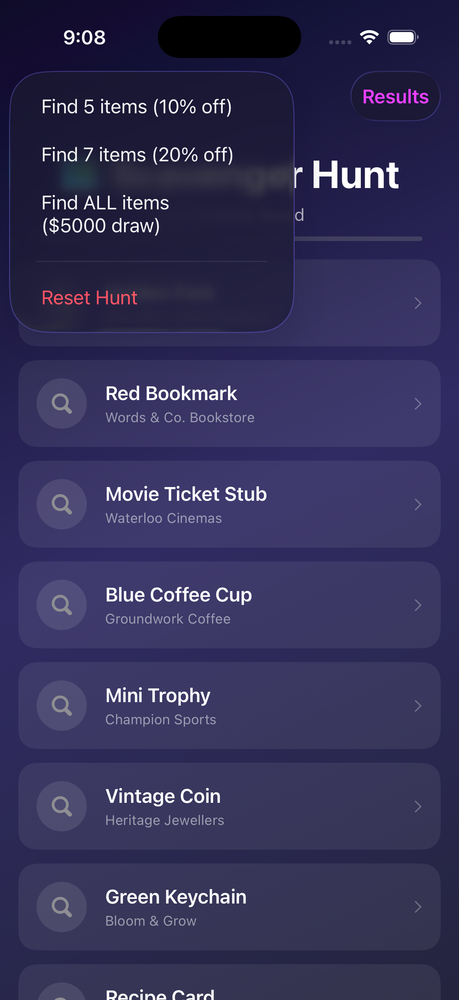

# 🗺️ iOSApp3 — Scavenger Hunt App

A scavenger hunt iOS app built with SwiftUI for the Waterloo Chamber of Commerce.  
Participants find hidden items at local businesses, take photos as proof, and earn discount codes based on how many items they find.

---

## 📱 Features

- **10 clues** hidden across local Waterloo businesses
- **Camera integration** — take a photo to confirm each item found
- **Discount system:**
  - 5+ items found → 10% discount code
  - 7+ items found → 20% discount code
  - All 10 items found → entered into a **$5,000 grand prize draw**
- **Submit results** online with confirmation alert
- **Dark mode UI** with gradient backgrounds
- **Demo Mode** to simulate found items for testing

---

## 📸 Screenshots

<p align="center">
  
  
  
</p>

<p align="center">
  
  
  
</p>

---

## 🛠️ Tech Stack

- Swift 5
- SwiftUI
- UIKit (UIImagePickerController for camera)
- Xcode 15+

---

## 🗂️ Project Structure

iOSApp2/
├── Models/
│   ├── ScavengerItem.swift   # Data model for each hunt item
│   └── HuntSession.swift     # ObservableObject managing app state
├── Views/
│   ├── ContentView.swift     # Main screen with item list
│   ├── ClueDetailView.swift  # Clue detail + camera trigger
│   ├── CameraView.swift      # UIImagePickerController wrapper
│   └── ResultsView.swift     # Results, discount codes, and submit
└── iOSApp2App.swift

---

## 🚀 Getting Started

1. Clone the repo:
```bash
   git clone https://github.com/jeanvq/iOSapp2.git
```
2. Open `iOSApp2.xcodeproj` in Xcode
3. Select a simulator or device
4. Press **⌘ + R** to run

---

## 🎮 Demo Mode

Use the **🎮 Demo** button in the top-left corner to simulate finding items:
- Find 5 items → test 10% discount
- Find 7 items → test 20% discount
- Find ALL items → test grand prize entry
- Reset Hunt → start over

---

## 👨‍💻 Author

**Jeancarlo** — Web & Mobile Development Student @ triOS College  
[jeancarlodev.com](https://jeancarlodev.com) · [GitHub](https://github.com/jeanvq)

